# dfirbench

**An AI-assisted Digital Forensics and Incident Response (DFIR) workbench.** Upload evidence, get a
unified timeline, automatic detections mapped to MITRE ATT&CK, AI explanations that cite the
evidence they rely on, and signed, court-ready reports, while every file stays under a
tamper-evident chain of custody.

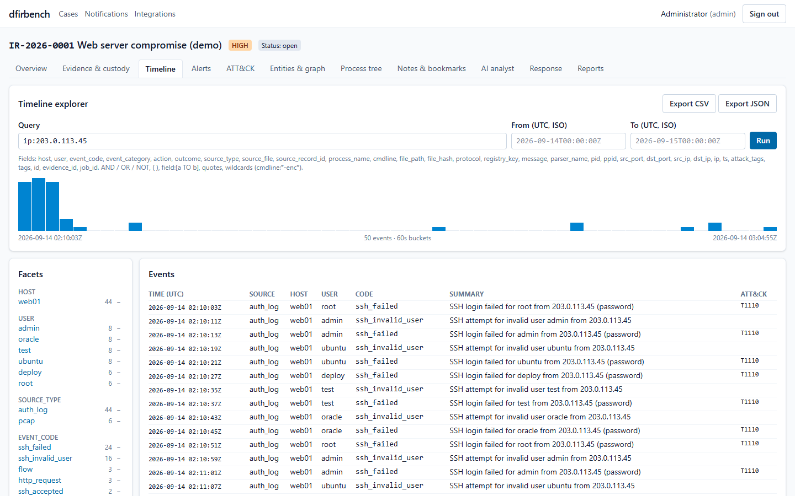

| | |
|---|---|
| **Stack** | FastAPI · PostgreSQL 16 + pgvector · Redis/Celery · MinIO (WORM evidence vault) · React 19 + TypeScript · Docker Compose |
| **Status** | v0.1.0. All 12 roadmap phases built ([`docs/specs/ROADMAP.md`](docs/specs/ROADMAP.md)); 1,426 backend tests and 116 frontend tests pass; 91 % line coverage ([test report](docs/validation/TEST_REPORT.md)) |
| **Docs** | [User guide](docs/user-guide.md) · [Admin guide](docs/admin-guide.md) · [Live demo walkthrough](data/demo/README.md) · [Limitations](docs/limitations.md) |
| **Licence** | [MIT](LICENSE) ([third-party notices](THIRD_PARTY.md)) |

---

## Contents

1. [What is DFIR?](#what-is-dfir)
2. [What dfirbench does](#what-dfirbench-does)
3. [Features](#features)
4. [How it works: the workflow](#how-it-works-the-workflow)
5. [System architecture](#system-architecture)
6. [Tech stack](#tech-stack)
7. [How it helps in real cases](#how-it-helps-in-real-cases)
8. [Screenshots](#screenshots)
9. [Quickstart](#quickstart)
10. [Try the demo case](#try-the-demo-case)
11. [Documentation](#documentation)
12. [Development and tests](#development-and-tests)
13. [Repository layout](#repository-layout)
14. [Limitations](#limitations)
15. [Licence and contributors](#licence-and-contributors)

---

## What is DFIR?

**Digital Forensics and Incident Response** is the part of cybersecurity that deals with an attack
after it happened (or while it is happening):

* **Incident response** asks: *What is going on, how bad is it, and how do we stop it?* Responders
  contain the attacker (isolate machines, disable accounts), remove them, and restore normal
  operation.
* **Digital forensics** asks: *What exactly happened, and can we prove it?* Investigators collect
  evidence such as logs, disk images, memory and network captures, and reconstruct the attacker's
  steps without altering the evidence, so the findings hold up in front of management, regulators
  or a court.

A typical investigation answers: *How did they get in? Which accounts and machines did they touch?
What did they take? Are they still here?* To answer that, analysts must combine thousands to
millions of records from different sources into one timeline, spot the malicious ones, and
document every step. Done by hand with separate tools and spreadsheets, that is slow and
error-prone, and it is easy to break the chain of custody along the way.

## What dfirbench does

dfirbench brings the whole investigation into one web application:

1. **Preserve**: evidence is hashed while it uploads and stored write-once. Every action on it is
   recorded in a signed, hash-chained custody log that anyone can verify.
2. **Parse and normalise**: 16 parsers turn Windows event logs, Linux logs, registry hives,
   browser history, packet captures, disk and memory images and more into one common event format
   with UTC timestamps. Parsers run in an isolated sandbox, because evidence may be hostile.
3. **Detect**: a rule engine (single-event, threshold and sequence rules, Sigma import), IOC
   matching and anti-forensics detectors raise alerts, scored and mapped to MITRE ATT&CK.
4. **Investigate**: a fast timeline with a search language, facets and a histogram; alerts with
   their linked events; an ATT&CK heatmap; an entity graph; process trees; notes and bookmarks.
5. **Assist with AI**: explain an alert, answer questions about the case, turn plain language into
   a query, write an attack narrative, decode an obfuscated script. Every AI statement must cite
   the case's own records, is checked by the server, and counts only after a person accepts it.
6. **Respond**: playbooks guide containment and recovery, with four-eyes approval for impactful
   actions, notifications and integrations.
7. **Report**: technical, executive, custody and IOC reports are built from a frozen snapshot,
   checked by a quality gate, approved by a second person and signed. They can be verified offline,
   byte for byte.

## Features

| Area | What you get |
|---|---|
| **Evidence and custody** | Streaming upload with SHA-256 and MD5; MinIO vault with Object Lock (compliance mode); Ed25519-signed, hash-chained custody log; append-only custody and audit tables enforced by database triggers; on-demand hash verification; signed evidence export packages; offline verifier |
| **Parsing** | EVTX, Linux auth/syslog, journald JSON, wtmp/btmp, shell histories, registry hives (services, USB, ShimCache, BAM, Run keys, UserAssist, ...), Amcache, Prefetch, LNK, Chromium and Firefox history, PE triage, pcap/pcapng (flows, DNS, HTTP, TLS SNI), Sleuth Kit file-system timeline, Volatility 3 memory analysis, YARA, optional Zeek ([`docs/parsers.md`](docs/parsers.md)) |
| **Collection** | Read-only triage collectors for Windows (PowerShell 5.1) and Linux (Python 3, also from mounted images) producing ZIP bundles with a hash manifest; bundles are verified member by member at ingest ([`docs/collection.md`](docs/collection.md)) |
| **Detection** | 25 built-in rules across 14 ATT&CK techniques, YAML rule format, Sigma subset import, IOC lists (CSV, JSON, STIX 2.1), anti-forensics detectors (log gaps, out-of-order timestamps, EVTX record gaps), alert deduplication, risk scoring, alert lifecycle ([`docs/detection-coverage.md`](docs/detection-coverage.md)) |
| **Analysis UI** | Timeline explorer with a safe search language (no SQL), facets, histogram, context, CSV/JSON export; alerts; ATT&CK matrix; entity resolution and graph; process tree; notes with version history; bookmarks |
| **AI layer** | Providers: Anthropic Claude, Ollama, any OpenAI-compatible server, or an offline demo provider. Alert explanation, case chat (RAG over pgvector), natural-language search, attack narrative, script decoding and explanation, AI report drafts. Prompt-injection defences, schema and citation validation, redaction, rate limits and budgets, full provenance per answer, offline evaluation harness ([`docs/ai.md`](docs/ai.md)) |
| **Response** | 8 YAML playbooks (ransomware, credential compromise, exfiltration, malware, phishing, log tampering, web shell, cloud), dry runs, four-eyes approvals, Slack/Teams/e-mail/in-app notifications, signed outbound webhooks, HMAC-signed SIEM/EDR inbound webhooks, VirusTotal/MISP enrichment ([`docs/response.md`](docs/response.md)) |
| **Reporting** | Technical, executive, custody and IOC reports as HTML, PDF, JSON, STIX 2.1 and CSV; QA gate; four-eyes approval; Ed25519 signatures; deterministic re-rendering; offline verification ([`docs/reports.md`](docs/reports.md)) |
| **Security** | Argon2id passwords, TOTP MFA, 5-role RBAC with case isolation, per-IP rate limits, least-privilege database role, sandboxed parsers (no network, read-only, no capabilities, separate uid), CSP and security headers, pinned images and dependencies, secret/dependency/image scans, SBOMs ([`docs/hardening.md`](docs/hardening.md)) |
| **Operations** | One-command Docker Compose deployment, encrypted and signed backups with a verified restore drill, read-only integrity check, Prometheus metrics, structured JSON logs ([`docs/backup-restore.md`](docs/backup-restore.md)) |

## How it works: the workflow

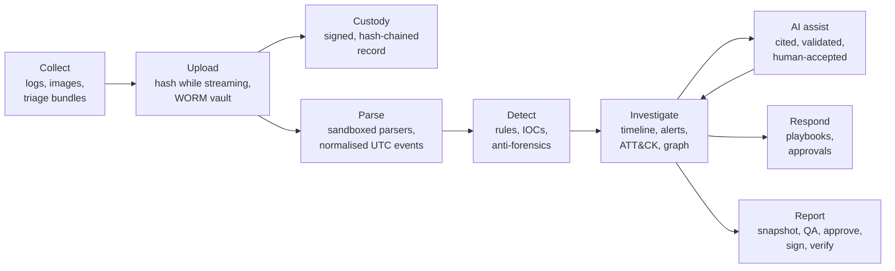

Step by step, for one piece of evidence:

1. **Upload.** The browser streams the file to the API, which computes SHA-256 and MD5 on the fly
   and writes it to the MinIO `evidence` bucket under Object Lock. A `created` and an `ingested`
   custody entry are signed and chained.
2. **Process.** A parse job is queued in Redis. The Celery worker re-verifies the original's hash,
   then hands a read-only copy to the **parser sandbox**: a container with no network, a read-only
   file system, no Linux capabilities and strict resource limits. The parser streams normalised
   events back; the worker stores them in PostgreSQL (partitioned by month) and records a run
   manifest with parser and tool versions and exact record counts, and a `processed` custody entry.
3. **Detect.** When parsing finishes, a detection job runs every enabled rule and the IOC list over
   the case and creates or updates alerts (deduplicated, scored, tagged with ATT&CK techniques).
4. **Investigate.** The analyst searches the timeline, triages alerts, follows entities in the
   graph, and bookmarks key events. Every request is checked against the user's role and case
   membership and written to the audit log.
5. **AI assist (optional).** The API builds an *evidence pack* from this case only, sanitises it
   (evidence is untrusted input), redacts secrets for hosted providers, and calls the model through
   one gateway. The answer must match a JSON schema, and every citation must point to a record
   that exists in the case, or it is rejected. Analysts accept or reject each answer.
6. **Report.** A report freezes a snapshot of the case. After QA, submission and approval by a
   second person, signing renders every format, hashes each file and signs the manifest with the
   custody key. Anyone with the public key can verify the report offline.

## System architecture

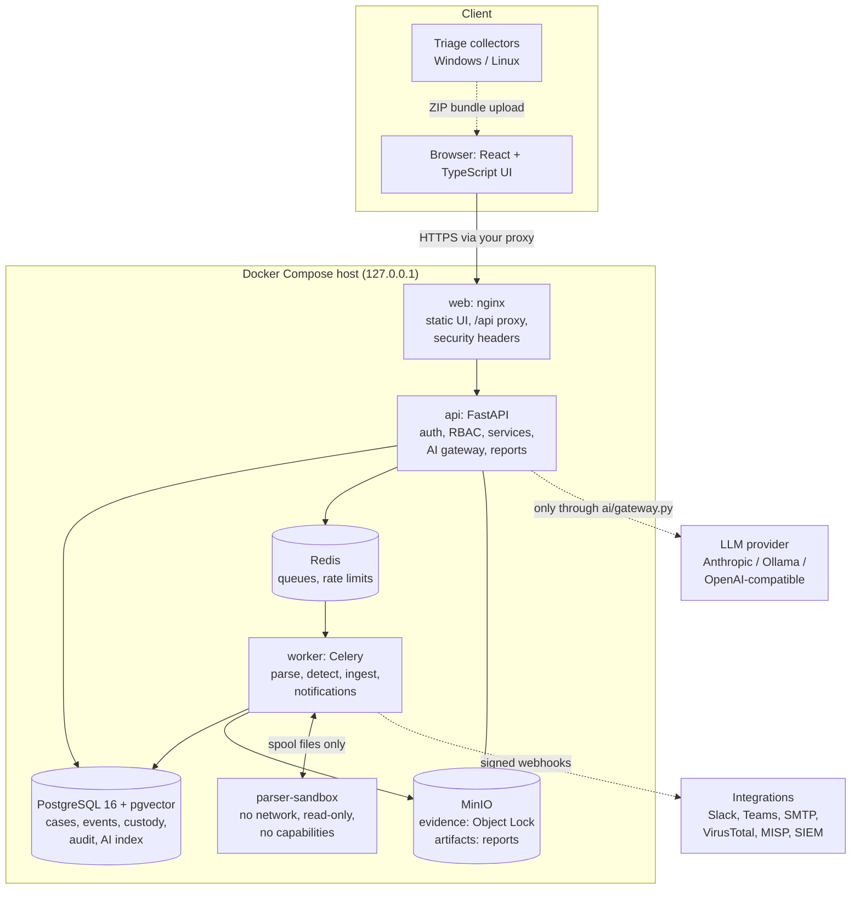

Design rules that keep the evidence trustworthy:

* **Originals are never modified.** The vault bucket is write-once; workers read copies.
* **Only one module writes custody entries** (`services/custody.py`), and only one module talks to
  a language model (`ai/gateway.py`).
* **Parsers and detection are pure**: no database, no network, no writes outside a scratch folder.
  They run in the sandbox, so a malicious file cannot reach the database, the vault or the keys.
* **Layering**: routers contain no business logic; services never import the web framework;
  workers use services and parsers, never the API.
* **Database-level guarantees**: custody and audit tables reject `UPDATE`, `DELETE` and `TRUNCATE`;
  report approval needs a different approver; signed reports are frozen; the application logs in
  as a least-privilege role that cannot bypass these rules.

The full design rationale is in [`docs/BUILD_GUIDE.md`](docs/BUILD_GUIDE.md) (Standard profile).

## Tech stack

| Layer | Technology | Why |
|---|---|---|
| API | Python 3.12, FastAPI, Pydantic v2, SQLAlchemy 2.0, Alembic | Typed, async-capable, OpenAPI docs out of the box |
| Jobs | Celery 5 with Redis | Retries, leases, progress, separate queues for parse, detect, AI and reports |
| Database | PostgreSQL 16 with pgvector | Partitioned event store, full-text search, triggers for append-only tables, vector search for case chat |
| Evidence vault | MinIO (S3 API) with Object Lock | Write-once storage in compliance mode, versioning |
| Frontend | React 19, TypeScript, Vite, Tailwind CSS, TanStack Query | Fast, typed UI; no heavy UI framework |
| Parsing | python-evtx, dpkt, pefile, LnkParse3, yara-python, own registry/Prefetch readers; Sleuth Kit, Volatility 3 | Pure-Python where possible; external engines as separate programs |
| Detection | Own YAML rule engine, RE2 regular expressions, Sigma subset converter | Linear-time regex (no ReDoS), reviewable rules |
| AI | Anthropic SDK, Ollama / OpenAI-compatible HTTP, local hashing embeddings | Provider choice, including fully local operation |
| Reports | Jinja2, markdown-it-py, ReportLab, STIX 2.1 | Deterministic PDFs, safe HTML, standard threat-intel export |
| Crypto | Argon2id, Ed25519, AES-256-GCM, scrypt, TOTP | Passwords, signatures, encrypted secrets and backups, MFA |
| Deployment | Docker Compose, nginx | One command on one host; images pinned by digest |
| Quality | pytest, Hypothesis, Vitest, ruff, mypy (strict), bandit, ESLint, gitleaks, pip-audit, Trivy, CycloneDX | CI on every push |

## How it helps in real cases

| Scenario | What dfirbench shows |
|---|---|
| **Brute-forced server** (the [demo case](data/demo/README.md)) | Burst of failed SSH logins, the successful one, the new sudo account and the root login as linked alerts (T1110, T1078, T1136, T1098); the attacker's commands from shell history; the download and the data upload in the packet capture; IOC hits across all sources |
| **Ransomware** | Shadow-copy deletion and disabled recovery (T1490), cleared event logs, new services from unusual paths; the ransomware playbook with approvals for isolation |
| **Compromised Windows account** | Brute force or password spray against Windows logons, logon after failures, accounts added to privileged groups, scheduled tasks and services for persistence, encoded PowerShell, with the process tree from event logs or memory |
| **Insider or data theft** | Browser downloads and searches, USB devices and recently used files from the registry, LNK files and Prefetch showing what ran and when, network flows to unusual destinations |
| **Log tampering** | Detectors for log gaps, out-of-order timestamps, EVTX record-id gaps, a log ending long before acquisition, system time changes and cleared logs |
| **Phishing and malware triage** | YARA and PE triage of suspicious files, decoding of obfuscated PowerShell and scripts without running them, IOC enrichment from VirusTotal or MISP, STIX export for partners |
| **Legal hold or hand-over** | Custody report with every chain verified, signed export packages, offline verification of reports and packages |
| **SOC escalation** | SIEM/EDR alerts arrive through signed webhooks into a case; playbooks, notifications and outbound webhooks keep other teams informed |

## Screenshots

| | |
|---|---|
| 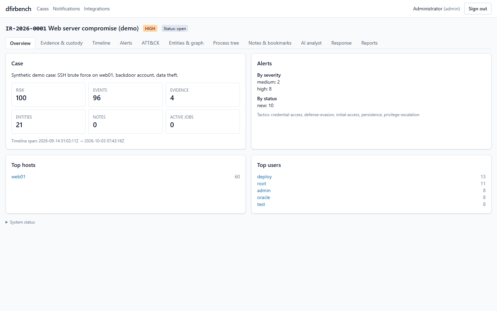 **Case overview**: risk, counts, alerts, top hosts and users | 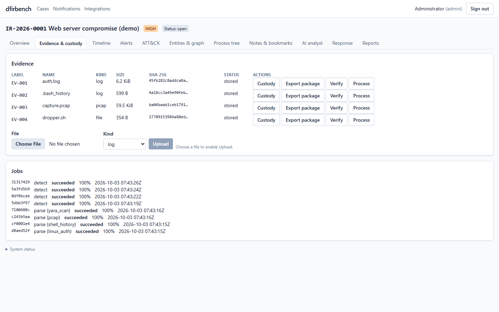 **Evidence & custody**: hashes, custody, verify, processing jobs |
| 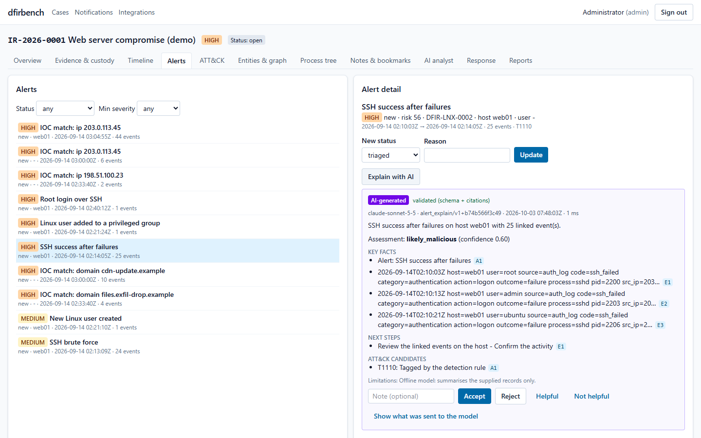 **Alerts** with an AI explanation and clickable citations | 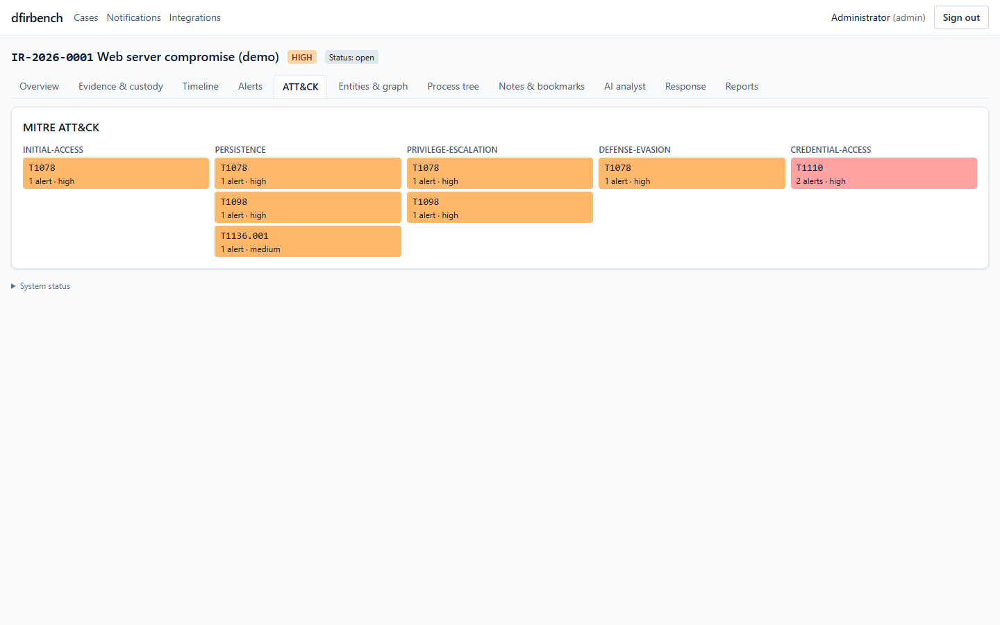 **ATT&CK heatmap** of the case's alerts |
| 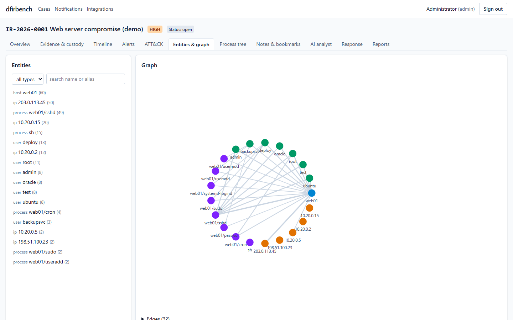 **Entity graph**: hosts, users, IPs, processes | 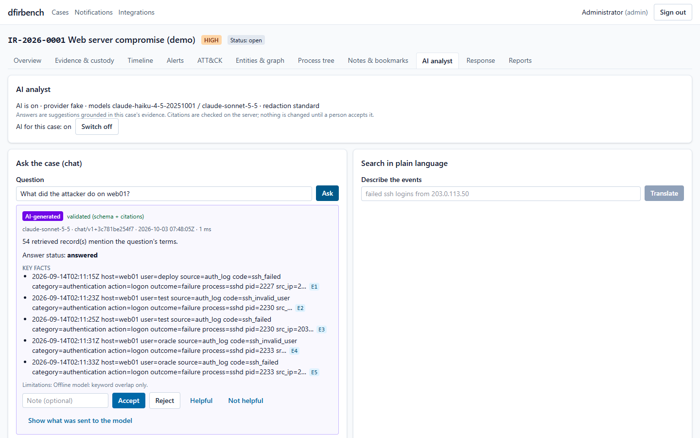 **AI analyst**: case chat with validated citations |
| 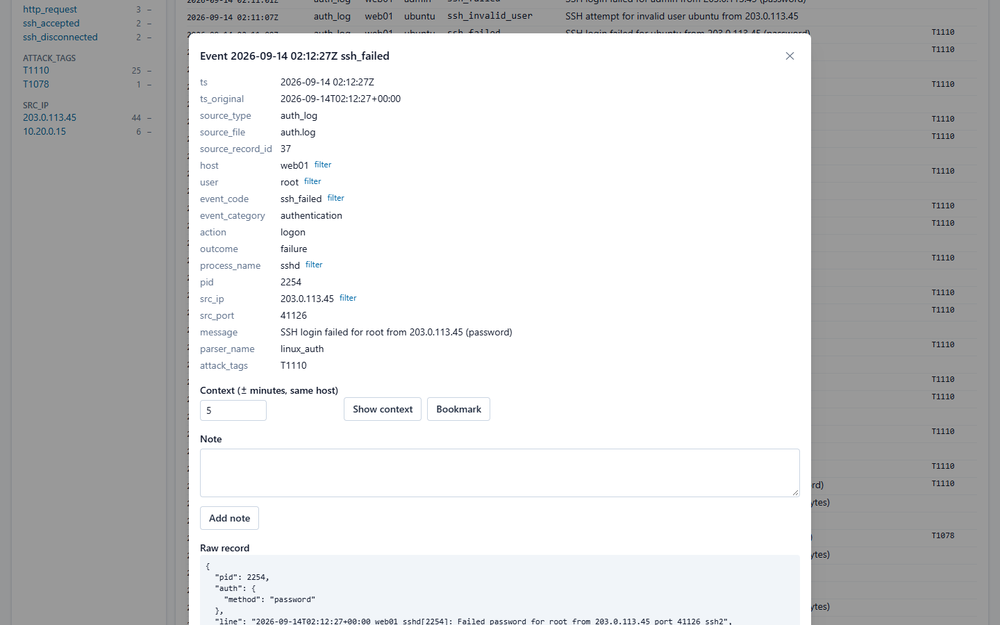 **Event detail**: fields, raw record, context | 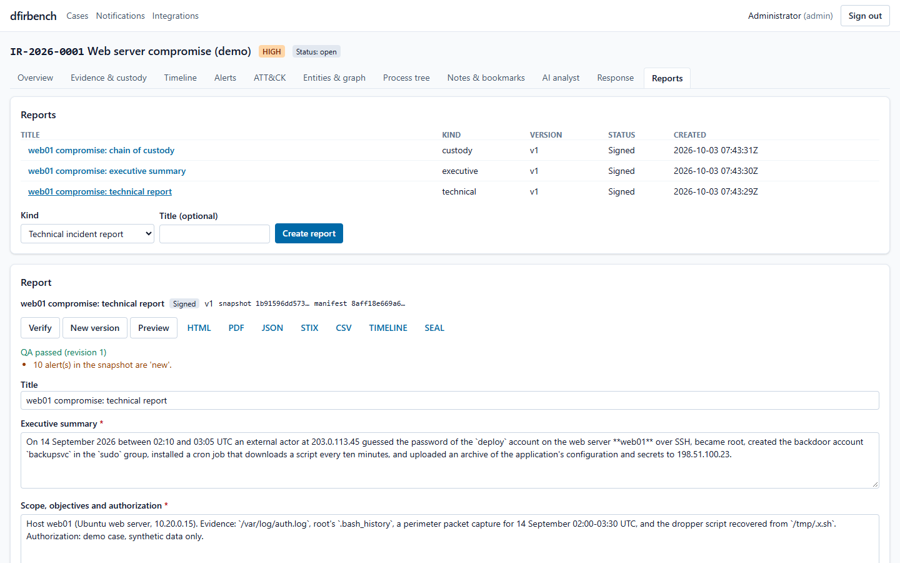 **Reports**: QA, approval, signature, downloads |

The screenshots use the offline demo AI provider, which writes short template answers. With a real
model the explanations are richer; the citations and validation work the same way.

## Quickstart

Requirements: Docker with Compose v2.24+ and about 8 GB of RAM ([details](docs/admin-guide.md#2-requirements)).

```bash
git clone https://github.com/Dhanush10D/dfir.git dfirbench && cd dfirbench

# start everything (add ENABLE_AI=true LLM_PROVIDER=fake for the offline AI demo provider)
docker compose -f infra/compose.yaml up -d --build
bash scripts/wait-healthy.sh

# create the first administrator (the password comes from the environment)
DFIR_ADMIN_PASSWORD='choose-a-long-passphrase' docker compose -f infra/compose.yaml exec -T \
  -e DFIR_ADMIN_PASSWORD api python -m app.cli create-admin --email admin@example.org
```

Then open:

| URL | What |
|---|---|
| <http://127.0.0.1:8080> | The web UI |
| <http://127.0.0.1:8000/api/v1/docs> | Interactive API documentation |
| <http://127.0.0.1:8000/api/v1/ready> | Readiness check (database, Redis, storage) |

The defaults are development placeholders. Before using real evidence, follow
[admin guide section 4](docs/admin-guide.md#4-configuration-for-real-use) (`APP_ENV=prod` refuses to
start with unsafe settings). Stop with `docker compose -f infra/compose.yaml down` (add `-v` to
delete all data).

## Try the demo case

[`data/demo/`](data/demo/README.md) contains synthetic evidence for one complete story: SSH brute
force on a web server, privilege escalation, a backdoor account, persistence and data
exfiltration (`auth.log`, `.bash_history`, `capture.pcap`, a harmless "dropper" script and an IOC
list). Upload it through the UI for a live demonstration, or load it in one go:

```bash
DFIR_ADMIN_PASSWORD='<admin password>' backend/.venv/Scripts/python scripts/demo-check.py --admin-email admin@example.org
```

The script creates the case, uploads and processes every file, and checks that the 10 expected
alerts fire (`DEMO CHECK PASSED`). The walkthrough explains what to show at each step.

## Documentation

| Document | For |
|---|---|
| [User guide](docs/user-guide.md) | Investigators: every screen and workflow, with screenshots |
| [Administrator guide](docs/admin-guide.md) | Install, configuration, users and roles, TLS, keys and rotation, backups, upgrades, monitoring, troubleshooting |
| [Demo walkthrough](data/demo/README.md) | Running a live demo with the synthetic case |
| [Limitations and future work](docs/limitations.md) | What dfirbench does not do (yet) |
| [Test report](docs/validation/TEST_REPORT.md) | Test results, coverage, AI evaluation, scans |
| [Tool validation](docs/validation/TOOL_VALIDATION.md) | Known-input validation of every parser and rule (NIST CFTT style) |
| [Benchmark](docs/validation/BENCHMARK.md) | Parse, ingest, search and detection performance |
| [Sample reports](docs/samples/) | Signed technical, executive and custody PDFs from the demo case |
| [Parsers](docs/parsers.md) · [Collection](docs/collection.md) · [Detection coverage](docs/detection-coverage.md) | Evidence sources and rules |
| [AI layer](docs/ai.md) · [Reports](docs/reports.md) · [Response](docs/response.md) | Feature references |
| [Hardening](docs/hardening.md) · [Backup and restore](docs/backup-restore.md) | Security and operations references |
| [Build guide](docs/BUILD_GUIDE.md) · [Roadmap](docs/specs/ROADMAP.md) · [Backlog](docs/BACKLOG.md) | Design, phase plan and deferred items |
| [Third-party notices](THIRD_PARTY.md) | Licences of dependencies, images and data |

## Development and tests

```bash
bash scripts/bootstrap.sh            # backend/.venv (Python 3.12) + frontend node_modules + .env
docker compose -f infra/compose.yaml up -d postgres redis minio

cd backend
.venv/Scripts/alembic upgrade head                 # Linux/macOS: .venv/bin/...
.venv/Scripts/python -m app.storage init           # create the vault buckets
.venv/Scripts/uvicorn app.main:app --reload        # http://127.0.0.1:8000
.venv/Scripts/celery -A app.workers.celery_app worker -Q default,parse,detect,ai,reports -P solo

cd ../frontend && npm run dev                      # http://127.0.0.1:5173 (proxies /api)
```

Checks (all run in CI on every push):

```bash
cd backend
.venv/Scripts/python -m pytest -q                  # unit + integration (integration needs the compose stack)
.venv/Scripts/ruff check . && .venv/Scripts/ruff format --check . && .venv/Scripts/mypy app
.venv/Scripts/python -m app.ai.eval                # offline AI evaluation

cd ../frontend
npm run lint && npm run typecheck && npm test && npm run build

bash scripts/verify-phase10.sh                     # full verification: stack, smokes, scans, benchmark, restore drill
```

Latest results: 1,114 unit and 312 integration tests, 116 frontend tests, 91.3 % line and 80.9 %
branch coverage, all AI evaluation targets met, no known vulnerable dependencies
([test report](docs/validation/TEST_REPORT.md)).

## Repository layout

```
backend/     FastAPI app (app/), Alembic migrations, tests (unit/, integration/, fixtures/)
  app/api/         HTTP routers (no business logic)
  app/services/    business logic (custody, evidence, jobs, detection, AI, reports, ...)
  app/parsers/     16 parsers + tool wrappers (pure, sandboxed)
  app/detection/   rule engine, built-in rules, Sigma, IOCs, YARA starter pack
  app/ai/          gateway, evidence packs, sanitizer, validators, RAG, evaluation
  app/reports/     snapshot, rendering (HTML/PDF/STIX/CSV), sealing, offline verifier
  app/sandbox/     parser sandbox server and child
frontend/    React + TypeScript UI (features/ per tab)
collector/   triage collectors (Windows PowerShell, Linux Python) and acquisition wrappers
infra/       compose.yaml, Dockerfiles, nginx configuration
data/demo/   synthetic demo evidence and walkthrough
scripts/     bootstrap, smoke and verify scripts, backup/restore, benchmark, scans, demo check
docs/        guides, references, validation reports, screenshots, sample reports, specs
```

## Limitations

dfirbench is a single-host platform (Standard profile) for small teams. It has no endpoint agent
(endpoint actions are recorded, not executed), no scheduler for periodic jobs, and some
administration is API-only. It is not a certified forensic tool, so cross-check important findings.
The full, honest list is in [`docs/limitations.md`](docs/limitations.md).

## Licence and contributors

Released under the [MIT License](LICENSE). Third-party components keep their own licences; see
[`THIRD_PARTY.md`](THIRD_PARTY.md).

Contributors:
1) Harshitha V
2) Dhanush S
3) Dhruthishree V
