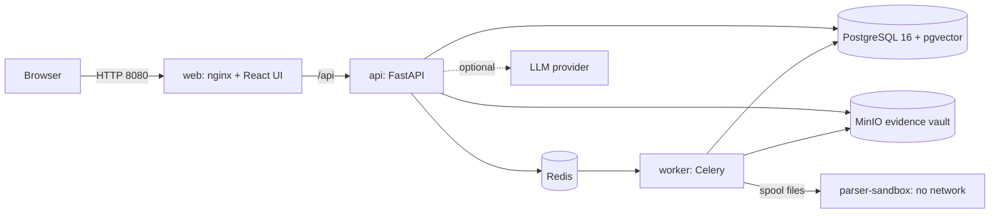

# Administrator guide

How to install, configure, secure, back up, upgrade and troubleshoot dfirbench. For day-to-day
investigation work, see the [user guide](user-guide.md). Deeper references: [hardening](hardening.md),
[backup and restore](backup-restore.md), [AI layer](ai.md), [response and integrations](response.md),
[collection](collection.md), [parsers](parsers.md).

**Contents**

1. [What gets deployed](#1-what-gets-deployed)
2. [Requirements](#2-requirements)
3. [Install and first start](#3-install-and-first-start)
4. [Configuration for real use](#4-configuration-for-real-use)
5. [Users, roles and access](#5-users-roles-and-access)
6. [AI providers](#6-ai-providers)
7. [Integrations and notifications](#7-integrations-and-notifications)
8. [TLS and network access](#8-tls-and-network-access)
9. [Keys and rotation](#9-keys-and-rotation)
10. [Backup, restore and integrity checks](#10-backup-restore-and-integrity-checks)
11. [Upgrades](#11-upgrades)
12. [Monitoring and logs](#12-monitoring-and-logs)
13. [Forensic engines, rules and playbooks](#13-forensic-engines-rules-and-playbooks)
14. [Troubleshooting](#14-troubleshooting)
15. [Stopping, resetting and uninstalling](#15-stopping-resetting-and-uninstalling)

---

## 1. What gets deployed

`infra/compose.yaml` defines the whole platform. Everything listens on `127.0.0.1` only.

| Service | Image | Port (host) | Role |
|---|---|---|---|
| `web` | `dfirbench/web` (nginx) | 8080 | Serves the React UI and proxies `/api` to the API |
| `api` | `dfirbench/api` (FastAPI) | 8000 | REST API, authentication, AI gateway, report rendering. OpenAPI docs at `/api/v1/docs` |
| `worker` | `dfirbench/worker` (Celery) | - | Background jobs: parsing (through the sandbox), detection, bundle ingest, notifications |
| `parser-sandbox` | `dfirbench/worker` | - | Runs every parser with **no network**, a read-only file system, no Linux capabilities and resource limits |
| `postgres` | `pgvector/pgvector` (PostgreSQL 16) | 5432 | Cases, events, custody chains, audit log, AI index |
| `redis` | `redis:7.4` | 6379 | Job queue, rate limits |
| `minio` | `pgsty/minio` | 9000 (console 9001) | Evidence vault (S3, **Object Lock** in compliance mode) and report artifacts |
| `migrate`, `storage-init`, `keygen` | one-shot jobs | - | Run database migrations and provision the app login; create the buckets; create the dev custody signing key |

Data lives in named Docker volumes (project `dfirbench`):

| Volume | Contents | Back up? |
|---|---|---|
| `dfirbench_pgdata` | PostgreSQL database | yes (backup script) |
| `dfirbench_miniodata` | Evidence originals (write-once), report artifacts | yes (backup script) |
| `dfirbench_custodykeys` | The Ed25519 custody signing key | yes, encrypted separately |
| `dfirbench_redisdata` | Queue state | no |
| `dfirbench_scratch`, `dfirbench_spool*`, `dfirbench_sandboxwork` | Temporary job files | no |



## 2. Requirements

| | Minimum (demo, small cases) | Recommended (team use) |
|---|---|---|
| CPU | 4 cores | 8 cores or more |
| RAM | 8 GB (close other heavy apps) | 16-32 GB |
| Disk | 30 GB free (images about 4 GB, plus evidence) | SSD, at least 3x the evidence you expect (originals + derived events + backups) |
| Software | Docker Engine or Docker Desktop with **Compose v2.24+** | Same, on Linux |
| OS | Linux, Windows 10/11 (Docker Desktop with WSL 2) or macOS | Linux server |

For development and the scripts in `scripts/`, you also need Python 3.12, Node.js 24 and Git Bash
on Windows.

## 3. Install and first start

```bash
git clone https://github.com/Dhanush10D/dfir.git dfirbench && cd dfirbench
docker compose -f infra/compose.yaml up -d --build      # first build takes 10-20 minutes
bash scripts/wait-healthy.sh                            # waits until every service is healthy
```

Check it:

```bash
curl http://127.0.0.1:8000/api/v1/health     # {"status":"ok", ...}
curl http://127.0.0.1:8000/api/v1/ready      # database, redis and storage checks
```

Create the first administrator. The password is read from an environment variable, never from
the command line, so it does not end up in your shell history or the process list:

```bash
DFIR_ADMIN_PASSWORD='choose-a-long-passphrase' docker compose -f infra/compose.yaml exec -T \
  -e DFIR_ADMIN_PASSWORD api python -m app.cli create-admin --email admin@example.org --name "Admin"
```

Open <http://127.0.0.1:8080> and sign in. Passwords need at least 12 characters and must not be on
the bundled list of common passwords.

> **Windows tip:** use `127.0.0.1`, not `localhost`, in URLs and connection strings. `localhost`
> tries IPv6 first and can stall for seconds.

The default configuration is for **development**: placeholder passwords, the offline AI
provider refused, AI switched off. Section 4 makes it safe for real evidence.

## 4. Configuration for real use

Configuration is environment variables. Copy the template and edit it:

```bash
cp .env.example .env
# edit .env, then always start with:
docker compose -f infra/compose.yaml --env-file .env up -d
```

`.env.example` documents every setting, but compose only passes **a subset** to the API and the
workers: the variables listed in the `x-backend-env` block of `infra/compose.yaml` (the stores,
secrets, custody key, AI provider and models, redaction policy, integration KEK, outbound policy,
enrichment switches, sandbox mode, `PARSER_TIMEOUT_S`, `VAULT_RETENTION_DAYS`, `METRICS_TOKEN` and
the auth rate limits), plus the port, subnet and sandbox resource variables that compose uses
itself. Any other setting (for example `MAX_UPLOAD_GB`, the session lifetimes, `AUDITOR_ALL_CASES`,
`REPORT_ORG_NAME`, the AI budgets and prices, `YARA_RULES_DIR`, `VOLATILITY_SYMBOLS_DIR`,
`COLLECTOR_TRUSTED_HASHES_PATH`, `INTEGRATION_KEK_PREVIOUS_PATH`, `AUTH_COOKIE_SECURE`) has no
effect in `.env` alone. Add it to the `x-backend-env` block, or keep your changes in an override
file next to `infra/compose.yaml`, for example `infra/compose.override.local.yaml`:

```yaml
x-extra-env: &extra-env
  MAX_UPLOAD_GB: "50"
  REPORT_ORG_NAME: "Example Corp CSIRT"
  AI_DAILY_BUDGET_USD: "25"
services:
  api:
    environment: *extra-env
  worker:
    environment: *extra-env
```

and start with `docker compose -f infra/compose.yaml -f infra/compose.override.local.yaml --env-file .env up -d`.
Compose merges the `environment` maps, so the base settings stay. Mounts (trusted keys file, YARA
rules, Volatility symbols, a KEK file) go into the same override file under `volumes:`.

### Production mode

Set `APP_ENV=prod`. The API and workers then **refuse to start** until the configuration is safe.
They check that:

* `JWT_SECRET` (or `JWT_PRIVATE_KEY_PATH`) and `TOTP_ENC_KEY` are set, at least 32 characters each
  and not the placeholders;
* `DATABASE_URL` logs in as the least-privilege role `dfirbench_app` with a real password
  (`DATABASE_APP_PASSWORD`, at least 16 characters), and `S3_SECRET_KEY` is set;
* `CUSTODY_SIGNING_KEY_PATH` and `CUSTODY_KEY_ID` are set;
* `CORS_ORIGINS` has no `*`;
* the parser sandbox is on (`SANDBOX_MODE=spool`);
* nothing meant for tests is on: `LLM_PROVIDER=fake`, `ENRICHMENT_FAKE`, `OUTBOUND_ALLOW_HTTP`;
* `INTEGRATION_KEK` and `METRICS_TOKEN`, if set, are at least 32 random characters.

A minimal production `.env`:

```bash
APP_ENV=prod
POSTGRES_PASSWORD=<random>              # database owner (used only by the migrate job)
DATABASE_APP_PASSWORD=<random, 16+>     # the app's own login
MINIO_ROOT_USER=dfir
MINIO_ROOT_PASSWORD=<random>
JWT_SECRET=<random, 32+>
TOTP_ENC_KEY=<random, 32+>
INTEGRATION_KEK=<random, 32+>
CUSTODY_KEY_ID=<key id, see section 9>
CORS_ORIGINS=https://dfir.example.org
PUBLIC_BASE_URL=https://dfir.example.org
```

Generate random values with:

```bash
python -c "import secrets; print(secrets.token_urlsafe(48))"
```

Keep `.env` out of version control (it is in `.gitignore`) and readable only by the operators.

### Settings you are most likely to change

"Override" means the setting needs the override file described above.

| Setting | Default | Meaning | How to set |
|---|---|---|---|
| `MAX_UPLOAD_GB` | 20 | Largest single upload | override |
| `VAULT_RETENTION_DAYS` | 3650 | Object Lock retention of evidence originals. **Cannot be shortened later** for objects already stored (compliance mode) | `.env` |
| `PARSER_TIMEOUT_S` | 3600 | Wall-clock limit per parse job | `.env` |
| `SANDBOX_MEM_LIMIT`, `SANDBOX_CPUS` | 2g, 1.0 | Resources of the parser sandbox | `.env` |
| `ACCESS_TOKEN_MINUTES`, `REFRESH_TOKEN_DAYS`, `SESSION_ABSOLUTE_DAYS` | 15, 7, 30 | Session lifetimes | override |
| `LOGIN_LOCKOUT_THRESHOLD` | 5 | Failed logins before an account is locked (with growing back-off) | override |
| `AUTH_RATE_LIMIT_PER_MINUTE` | 30 | Login and MFA attempts per client IP per minute | `.env` |
| `AUDITOR_ALL_CASES` | true | Auditors can read every case without being a member | override |
| `REPORT_ORG_NAME` | dfirbench | Organisation name on report covers and in STIX | override |
| `*_PORT` | 5432, 6379, 9000, 9001, 8000, 8080 | Host ports, if they collide with other software | `.env` |
| `WEB_SUBNET`, `WEB_IP` | 172.30.240.0/24, .10 | Fixed compose network; change it if it overlaps another Docker network | `.env` |

## 5. Users, roles and access

### Roles

Every user has one global role. For a case, the effective permissions are the global role's
permissions limited by the role the user has in that case. Admins (and auditors, while
`AUDITOR_ALL_CASES=true`) see every case; everyone else only sees cases they are a member of.
Outsiders get "not found", not "forbidden", so case names do not leak.

| Permission | admin | lead | analyst | viewer | auditor |
|---|:-:|:-:|:-:|:-:|:-:|
| Manage users, integrations | ✓ | | | | |
| Create cases | ✓ | ✓ | ✓ | | |
| Read case data | ✓ | ✓ | ✓ | ✓ | ✓ |
| Edit case, move status | ✓ | ✓ | ✓ | | |
| Manage members, close and reopen cases | ✓ | ✓ | | | |
| Add and process evidence | ✓ | ✓ | ✓ | | |
| Verify evidence hashes | ✓ | ✓ | ✓ | | ✓ |
| Download original evidence | ✓ | ✓ | | | ✓ |
| View custody chains | ✓ | ✓ | ✓ | | ✓ |
| Investigate (search, notes, bookmarks, reports) | ✓ | ✓ | ✓ | | |
| Triage alerts | ✓ | ✓ | ✓ | | |
| Approve and sign reports, approve impactful actions | ✓ | ✓ | | | |
| Use AI features | ✓ | ✓ | ✓ | | |
| Manage detection rules | ✓ | ✓ | | | |
| Read the global audit log | ✓ | | | | ✓ |

Typical setup: investigators are **analysts**, the person who signs reports is a **lead**,
management gets **viewer**, internal audit or legal gets **auditor**. Report approval always needs
two different people (four eyes), enforced by the database as well as the API.

### Managing users (API)

User management has no screen yet; use the interactive API docs at
<http://127.0.0.1:8000/api/v1/docs> (sign in with `POST /auth/login`, click **Authorize**, paste
the `access_token`) or `curl`:

```bash
API=http://127.0.0.1:8000/api/v1
TOKEN=$(curl -s -X POST $API/auth/login -H 'Content-Type: application/json' \
  -d '{"email":"admin@example.org","password":"<admin password>"}' \
  | python -c "import sys,json; print(json.load(sys.stdin)['tokens']['access_token'])")

# an analyst
curl -s -X POST $API/users -H "Authorization: Bearer $TOKEN" -H 'Content-Type: application/json' \
  -d '{"email":"asha@example.org","display_name":"Asha (analyst)","role":"analyst","password":"<12+ chars>"}'

# a lead or admin also needs your own password again (a role grant)
curl -s -X POST $API/users -H "Authorization: Bearer $TOKEN" -H 'Content-Type: application/json' \
  -d '{"email":"lee@example.org","display_name":"Lee (lead)","role":"lead","password":"<12+ chars>","admin_password":"<admin password>"}'
```

If your admin account has MFA, the login answers with an `mfa_challenge` instead of tokens; send
it with your code to `POST /auth/mfa/verify`.

| Task | Call |
|---|---|
| List users | `GET /users` |
| Change role, deactivate, unlock, reset MFA | `PATCH /users/{id}` with `role`, `is_active: false`, `unlock: true` or `reset_mfa: true` (role, activation and MFA changes need `admin_password`) |
| Deactivate | `DELETE /users/{id}` with `{"admin_password": "..."}` (users are deactivated, never deleted, so the audit trail keeps its names) |
| Add a member to a case | `POST /cases/{case_id}/members` `{"user_id": "...", "role": "analyst"}` (lead or admin) |

The system refuses to deactivate or demote the last active admin.

### MFA and personal API keys (each user)

* **MFA (TOTP):** `POST /users/me/mfa/enroll` returns a secret and an `otpauth://` URI for an
  authenticator app; `POST /users/me/mfa/confirm` with a code turns it on and returns one-time
  recovery codes. The login page then asks for the code. Turn MFA on at least for admins and leads.
* **API keys** for scripts: `POST /users/me/api-keys` `{"name": "...", "scopes": ["read"],
  "expires_in_days": 90}`. The key is shown once; send it as the `X-API-Key` header. Keys stop
  working when the user changes their password, signs out everywhere, is deactivated or has MFA
  reset.
* `POST /auth/logout-all` ends every session of the current user.

## 6. AI providers

AI is off until you set `ENABLE_AI=true`. Pick a provider:

| Goal | Settings |
|---|---|
| Anthropic Claude (hosted) | `LLM_PROVIDER=anthropic`, `LLM_API_KEY=<key>` |
| Local model, nothing leaves the host | `AI_LOCAL_ONLY=true`, `LLM_PROVIDER=ollama`, `LLM_BASE_URL=http://ollama:11434` (or a host address), model ids of models you pulled |
| Any OpenAI-compatible server (vLLM, LM Studio, llama.cpp) | `LLM_PROVIDER=openai_compat`, `LLM_BASE_URL=http://.../v1` |
| Demo without a model | `LLM_PROVIDER=fake` (refused in production) |

Model ids: `LLM_MODEL_FAST` (plain-language search) and `LLM_MODEL_STRONG` (explanations, narrative,
chat, scripts, report drafts). Cost and abuse controls: `AI_RATE_LIMIT_PER_MINUTE` per user,
`AI_CASE_RATE_LIMIT_PER_HOUR` per case, `AI_DAILY_TOKEN_BUDGET`, and `AI_DAILY_BUDGET_USD` once
`LLM_PRICE_INPUT_PER_MTOK` / `LLM_PRICE_OUTPUT_PER_MTOK` are set (these budget and price settings need the override file from section 4). For hosted providers, prompts are
redacted (`AI_REDACTION_POLICY=standard` removes e-mail addresses and secrets; `strict` also IPs,
user and host names). Case managers can switch AI off per case. Every AI call is stored with its
prompt, model, hashes and reviewer in `ai_interactions` and the audit log. Details:
[`docs/ai.md`](ai.md).

## 7. Integrations and notifications

Admins configure integrations on the **Integrations** page (outbound webhooks, Slack, Microsoft
Teams, e-mail, VirusTotal, MISP, inbound SIEM/EDR webhooks) and notification rules (which events
go to which channel and roles). Secrets typed there are stored encrypted (AES-256-GCM envelope
encryption) under the key-encryption key `INTEGRATION_KEK` (or a file in `INTEGRATION_KEK_PATH`);
without a KEK, secrets cannot be saved.

* **Outbound policy:** only `https` to public addresses by default. To reach an internal host
  (a mail relay, an on-premises MISP), list it in `OUTBOUND_ALLOW_HOSTS` (host names or CIDRs).
* **Enrichment** of indicators needs `ENABLE_ENRICHMENT=true` and the provider's integration
  enabled. Only indicator values are sent, never files, and TLP markings are respected.
* **Inbound webhooks** (`POST /api/v1/ingest/webhook/{integration id}`) must be HMAC-signed with a
  timestamp; size, item count and rate are limited.
* **Notification links** point to `PUBLIC_BASE_URL`.

Each integration has a **Test** button and a delivery log. Details: [`docs/response.md`](response.md).

## 8. TLS and network access

The stack binds to `127.0.0.1` on purpose. To let colleagues use it over the network, put a TLS
reverse proxy in front of the `web` service (port 8080) on the same host, and never publish ports
8000, 5432, 6379 or 9000-9001.

Example with Caddy (automatic certificates), `/etc/caddy/Caddyfile`:

```
dfir.example.org {
    reverse_proxy 127.0.0.1:8080
    request_body {
        max_size 21GB        # a bit above MAX_UPLOAD_GB
    }
}
```

Example with nginx (certificates from your CA):

```nginx
server {
    listen 443 ssl;
    server_name dfir.example.org;
    ssl_certificate     /etc/ssl/dfir.crt;
    ssl_certificate_key /etc/ssl/dfir.key;
    add_header Strict-Transport-Security "max-age=31536000" always;
    client_max_body_size 21g;
    proxy_request_buffering off;          # stream large uploads
    proxy_read_timeout 300s;
    location / {
        proxy_pass http://127.0.0.1:8080;
        proxy_set_header Host $host;
        proxy_set_header X-Forwarded-For $proxy_add_x_forwarded_for;
        proxy_set_header X-Forwarded-Proto https;
    }
}
```

Then:

1. Set `CORS_ORIGINS` and `PUBLIC_BASE_URL` to the public `https://` address.
2. Tell the web container which proxy to trust for client addresses, or every user would share one
   login rate-limit bucket: copy `infra/docker/real-ip.conf`, put your proxy's address in
   `set_real_ip_from`, and point `WEB_REAL_IP_CONF` at the copy (see
   [`docs/hardening.md`](hardening.md#authentication-limits)).
3. Keep `AUTH_COOKIE_SECURE=true` (the default; changing it needs the override file): the refresh cookie is then only sent over HTTPS.

## 9. Keys and rotation

| Key | Where | Protects | Rotation |
|---|---|---|---|
| Custody signing key (Ed25519) | `custodykeys` volume (`/var/lib/dfirbench/keys/custody-dev.pem`) | Signatures on custody entries, reports, export packages, backup manifests | Planned, old signatures stay valid (below) |
| Trusted keys file | `CUSTODY_TRUSTED_KEYS_PATH` (read-only mount) | Which public keys verification accepts | Add every retired key |
| `JWT_SECRET` | `.env` | Login tokens | Change it and restart: **everyone is signed out** |
| `TOTP_ENC_KEY` | `.env` | MFA secrets at rest | No re-encryption tool: after a change, reset MFA for every user (`PATCH /users/{id}` `reset_mfa`) and let them enrol again |
| `INTEGRATION_KEK` | `.env` or `INTEGRATION_KEK_PATH` | Integration secrets | Without loss (below) |
| `DATABASE_APP_PASSWORD`, `POSTGRES_PASSWORD`, `MINIO_ROOT_PASSWORD` | `.env` | Stores | Change in the service and in `.env`, restart; the migrate job re-provisions the app login |
| `METRICS_TOKEN` | `.env` | `/metrics` | Change it and update the scraper |
| Backup passphrases | operator's password manager | Backups | New passphrases apply to new backups |

**Find the custody key id** (needed for `CUSTODY_KEY_ID` in production):

```bash
docker compose -f infra/compose.yaml run --rm --no-deps -T api \
  python -m app.core.signing show /var/lib/dfirbench/keys/custody-dev.pem
```

**Rotate the custody signing key** without breaking old signatures:

1. Take a backup (section 10).
2. Add the current public key to the trusted keys file:
   `python -m app.core.signing trust <current.pem> --file trusted.json`.
3. Generate the new key: `python -m app.core.signing generate --out new.pem`, and replace the key
   file in the `custodykeys` volume with it (keep the old one offline).
4. Set `CUSTODY_KEY_ID` to the new id (from `signing show`), mount `trusted.json` read-only and
   set `CUSTODY_TRUSTED_KEYS_PATH` to it (compose override file). Restart `api` and `worker`.
5. Run `python -m app.cli integrity-check` to confirm that every chain still verifies.

**Rotate the integration KEK:** put the old key in a JSON file `{"<old id>": "<old key>"}` and set
`INTEGRATION_KEK_PREVIOUS_PATH` to it (override file from section 4, with the JSON file mounted read-only), set the new `INTEGRATION_KEK` and a new `INTEGRATION_KEK_ID`,
restart, then run `python -m app.cli rewrap-integration-secrets` in the api container. Remove the
old key afterwards.

## 10. Backup, restore and integrity checks

Backups run on the Docker host with the backend virtualenv (`bash scripts/bootstrap.sh` creates
it). Two passphrases, each at least 20 characters and different, come from the environment:

```bash
BACKUP_PASSPHRASE='<data passphrase>' BACKUP_KEYS_PASSPHRASE='<key passphrase>' \
  backend/.venv/Scripts/python scripts/backup.py --out /backups/dfir-2026-10-03
```

* The script stops `web`, `api` and `worker` for a few minutes (a maintenance window), dumps the
  database, copies the MinIO volume with its object versions and retention, writes a **signed state
  manifest** (every evidence hash, every custody chain head, every signed report), then restarts
  everything, even after an error.
* Everything is encrypted (AES-256-GCM, scrypt key derivation). The custody signing key has its own
  passphrase, so whoever restores data cannot sign custody records without it.
* Copy backups off the host. Run at least daily while a case is active.

**Restore drill** (into a separate project, then thrown away):

```bash
docker compose -f infra/compose.yaml run --rm --no-deps -T api \
  python -m app.core.signing show /var/lib/dfirbench/keys/custody-dev.pem > pub.txt
# build trusted.json ({key_id: public PEM}) from it with: python -m app.core.signing trust
BACKUP_PASSPHRASE=... BACKUP_KEYS_PASSPHRASE=... backend/.venv/Scripts/python scripts/restore.py \
  --from /backups/dfir-2026-10-03 --project dfirbench-restore --trusted-keys trusted.json
```

It ends with `RESTORE VERIFIED` (exit 0) only if every file matches, every custody chain and
signature verifies, and every original's bytes still match their signed hash. To restore for real,
stop the stack and run the same command with `--project dfirbench --force`; the live volumes are
copied aside first. Exit codes and the rollback procedure: [`docs/backup-restore.md`](backup-restore.md).

**Integrity check without a backup** (read-only; schedule it nightly with cron or Task Scheduler):

```bash
docker compose -f infra/compose.yaml exec -T api python -m app.cli integrity-check
# exit 0 = clean, 1 = findings (JSON on stdout), 2 = error
```

## 11. Upgrades

1. Read the release notes or the commit log for migration notes.
2. **Back up** (section 10).
3. Get the new version and rebuild:

   ```bash
   git pull
   docker compose -f infra/compose.yaml --env-file .env build
   docker compose -f infra/compose.yaml --env-file .env up -d
   bash scripts/wait-healthy.sh
   ```

   The `migrate` job runs `alembic upgrade head` before the API starts.
4. Check: `curl http://127.0.0.1:8000/api/v1/ready`, sign in, open a case, run
   `python -m app.cli integrity-check`.
5. If something is wrong, restore the backup taken in step 2 (migrations are not designed to be
   rolled back on live data).

**Base image updates.** Every image is pinned by tag and digest. To take security fixes, pull the
new tag, read its digest with `docker buildx imagetools inspect <image:tag>`, replace the digest in
`infra/compose.yaml` or the Dockerfile, rebuild and run `bash scripts/verify-phase10.sh`.
`bash scripts/scan.sh` runs the dependency, secret and image scans.

## 12. Monitoring and logs

* **Health:** `GET /api/v1/health` (process alive) and `GET /api/v1/ready` (database, Redis and
  storage reachable). The UI footer has a *System status* panel.
* **Logs:** `docker compose -f infra/compose.yaml logs -f api worker parser-sandbox`. The backend
  logs JSON lines (`LOG_JSON=true`) with a request id that also appears in API error responses.
* **Metrics:** set `METRICS_TOKEN`, then scrape `GET http://127.0.0.1:8000/metrics` with
  `Authorization: Bearer <token>`. Families cover HTTP requests, jobs, ingest rate, evidence states,
  custody verification failures, outbound deliveries, AI calls and cost, and queue depth. Alert on:
  `dfir_custody_verification_failures` increasing, `dfir_queue_depth{queue="parse"} > 0` for 30
  minutes, `dfir_metrics_section_up == 0`, and the 5xx rate.
* **Audit log:** every API request and every security-relevant action is in `audit_log`
  (append-only; admins and auditors read it with `GET /api/v1/audit`).

## 13. Forensic engines, rules and playbooks

* **YARA rules:** the starter pack is built in. Add your own `*.yar` files on a read-only mount and
  set `YARA_RULES_DIR` (both in the override file from section 4). Rules are never accepted through the API.
* **Volatility symbols:** mount a symbol pack (ISF) read-only and set `VOLATILITY_SYMBOLS_DIR` (override file);
  without it, memory plugins fail with Volatility's "Unsatisfied requirement" message.
* **Zeek** (optional): build a derived worker image with `zeek` on the `PATH`, then request the
  `zeek` parser explicitly.
* **Trusted collectors:** bundles from the shipped collectors are recognised by hash. If you modify
  a collector script, add its SHA-256 to a file in `COLLECTOR_TRUSTED_HASHES_PATH` (mounted read-only through the override file) (same format as
  `backend/app/collection/trusted_collectors.json`).
* **Detection rules:** `GET /api/v1/rules`; leads and admins can create, enable, disable and
  import Sigma rules through the `/rules` endpoints. `GET /api/v1/rules/coverage` shows ATT&CK
  coverage.
* **Playbooks:** the eight built-in playbooks load on first use or with
  `docker compose exec api python -m app.cli sync-playbooks`. Leads can import custom YAML
  playbooks with `POST /api/v1/playbooks`.

### Database notes

* The `migrate` job creates the `vector` extension, which needs a superuser (the compose owner is
  one). On a managed PostgreSQL where the owner is not a superuser, create the extension
  beforehand: `CREATE EXTENSION vector;`.
* Event ingest uses a temporary staging table, so `dfirbench_app` needs the database's `TEMPORARY`
  privilege. PostgreSQL grants it to everyone by default; if you revoked it, grant it to
  `dfirbench_app`.

## 14. Troubleshooting

| Symptom | Cause and fix |
|---|---|
| `invalid pool request: Pool overlaps with other one` on `up` | Another Docker network uses `172.30.240.0/24`. Set `WEB_SUBNET` and `WEB_IP` to a free range, or remove the old network (`docker network ls`). |
| A port is already in use | Change `API_PORT`, `WEB_PORT`, `POSTGRES_PORT` etc. in `.env`. |
| API exits at start with `invalid prod configuration: ...` | `APP_ENV=prod` found an unsafe setting; the message lists each one (section 4). |
| Containers restart or jobs die on a laptop | Not enough memory. Close browsers and video calls, give Docker Desktop more memory, or stop services you are not using. |
| A job stays *queued* or *running* | Check `docker compose logs worker parser-sandbox`. Cancel it with `POST /api/v1/jobs/{id}/cancel`, then `POST /api/v1/jobs/{id}/retry`. |
| "No parser recognizes this evidence" | The file type has no automatic parser. Name one: `POST /evidence/{id}/process` `{"parsers": ["<name>"]}` (list in `docs/parsers.md`). |
| AI buttons answer `ai_unavailable` (503) | `ENABLE_AI=true` without a working provider (missing `LLM_API_KEY`, unreachable `LLM_BASE_URL`). |
| AI answers 429 | A rate limit or the daily budget was reached; the response says when to retry. |
| Login answers 429 | Too many attempts from one address; wait a minute. Behind a proxy, configure `WEB_REAL_IP_CONF` (section 8). |
| An account is locked | `PATCH /users/{id}` `{"unlock": true, "admin_password": "..."}`. |
| Report sign answers `report_too_large` (413) | The report hit the page or time limit; raise `REPORT_RENDER_TIMEOUT_S` or narrow the report. |
| Antivirus on Windows quarantines repository files | Some test fixtures and YARA rules contain well-known malware *strings* (EICAR, Mimikatz names) on purpose. Exclude the repository folder from scanning, or restore the file. |

## 15. Stopping, resetting and uninstalling

```bash
docker compose -f infra/compose.yaml stop          # stop, keep everything
docker compose -f infra/compose.yaml down          # remove containers and network, keep data volumes
docker compose -f infra/compose.yaml down -v       # also DELETE all data (cases, evidence, keys)
```

`down -v` deletes the evidence vault and the custody signing key. Take and verify a backup first
if anything in it matters.
