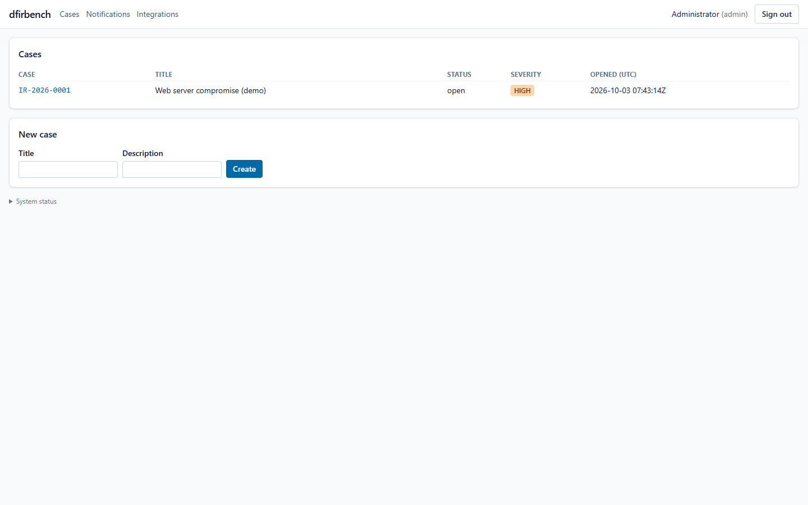
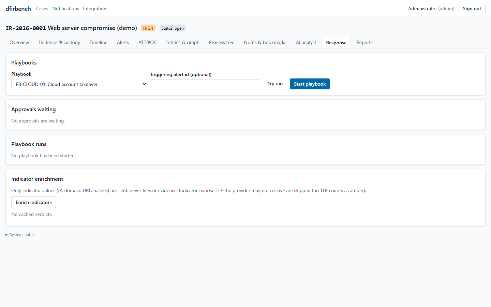

# User guide

This guide is for investigators: analysts, leads and anyone who reviews cases. It walks through
the screens of dfirbench in the order you use them during an investigation. Installation and user
management are in the [administrator guide](admin-guide.md).

The screenshots show the synthetic demo case from [`data/demo/`](../data/demo/README.md): an SSH
brute-force attack on a web server called `web01`. You can load the same case yourself and follow
along.

**Contents**

1. [Key ideas](#1-key-ideas)
2. [Signing in](#2-signing-in)
3. [Cases](#3-cases)
4. [The case workspace](#4-the-case-workspace)
5. [Adding evidence](#5-adding-evidence)
6. [Chain of custody](#6-chain-of-custody)
7. [Timeline](#7-timeline)
8. [Alerts](#8-alerts)
9. [ATT&CK view](#9-attck-view)
10. [Entities, graph and process tree](#10-entities-graph-and-process-tree)
11. [Notes and bookmarks](#11-notes-and-bookmarks)
12. [AI analyst](#12-ai-analyst)
13. [Response playbooks](#13-response-playbooks)
14. [Reports](#14-reports)
15. [Collecting evidence from a computer](#15-collecting-evidence-from-a-computer)
16. [Notifications](#16-notifications)
17. [Tips and common questions](#17-tips-and-common-questions)

---

## 1. Key ideas

| Term | Meaning |
|---|---|
| **Case** | One investigation (for example "Web server compromise"). Everything else belongs to a case, and only case members can see it. |
| **Evidence** | A file you upload: a log, an event log, a packet capture, a disk or memory image, a triage bundle. The original is stored **write-once** and never changed. |
| **Custody chain** | A signed, tamper-evident record of everything that happened to an evidence item: who uploaded it, its hashes, every verification, processing run and download. |
| **Job** | Background work on evidence: parsing it into events, or running detection. |
| **Event** | One normalised record taken from evidence, such as a login, a command, a network flow or a registry change. All times are **UTC**; the original timestamp text is kept. |
| **Alert** | A detection rule or indicator matched one or more events. Alerts have a severity, a risk score, MITRE ATT&CK techniques and a status you manage. |
| **IOC** | An indicator of compromise (IP address, domain, URL, file hash, e-mail, file name) that dfirbench looks for in the events. |
| **Report** | A signed document built from a frozen snapshot of the case: technical, executive, custody or IOC report. |

Your **role** decides what you can do: *analysts* investigate, *leads* also approve and sign reports
and manage case members, *viewers* read, *auditors* read and verify custody. See the role table in
the [administrator guide](admin-guide.md#roles).

## 2. Signing in

Open the address your administrator gave you (for a local install: <http://127.0.0.1:8080>) and
enter your e-mail address and password. If two-factor authentication is on, enter the 6-digit code
from your authenticator app, or a recovery code.

* Sessions renew themselves while you work and end after a period of inactivity.
* **Sign out** is at the top right. After 5 wrong passwords, the account is locked for a while.
* The *System status* line at the bottom of every page shows whether the API, database, queue and
  storage are healthy.

## 3. Cases



**Cases** lists the investigations you can see, with their number (`IR-YYYY-NNNN`), title,
severity, status and opening date. To start one, fill in the **Create a case** form (title,
severity, optional description) and press **Create**. The case opens, and you are its first member.

To add colleagues to a case, a lead or admin adds them as members (see the administrator guide;
there is no membership screen yet).

## 4. The case workspace


The header shows the case number, title, severity and status. The tabs:

| Tab | What you do there |
|---|---|
| **Overview** | Risk score, counts of events, evidence, entities, notes and running jobs, alerts by severity and status, top hosts and users, the time span of the evidence |
| **Evidence & custody** | Upload and process evidence, check hashes, view custody chains, export evidence packages |
| **Timeline** | Search and filter all events of the case |
| **Alerts** | Review and triage what the detection rules found |
| **ATT&CK** | See which attacker techniques the alerts point to |
| **Entities & graph** | Hosts, users, IP addresses and processes, and how they are connected |
| **Process tree** | Parent-child process trees per host |
| **Notes & bookmarks** | Case notes with history, bookmarked events |
| **AI analyst** | Ask questions, search in plain language, get an attack narrative, explain scripts |
| **Response** | Run response playbooks and approve impactful steps |
| **Reports** | Write, review, sign and download reports |

A **closed** case is read-only: you can still read, search, download and verify, but not change
anything.

## 5. Adding evidence


1. Open **Evidence & custody**.
2. **Choose File**, pick the **Kind** that describes it, and press **Upload**.

   | Kind | Use for |
   |---|---|
   | `log` | Text logs: Linux `auth.log`/`secure`/`syslog`, `journalctl -o json` output, shell histories (`.bash_history`, `.zsh_history`, PowerShell `ConsoleHost_history.txt`) |
   | `evtx` | Windows event logs (`Security.evtx`, `System.evtx`, ...) |
   | `pcap` | Packet captures (`.pcap`, `.pcapng`) |
   | `triage_bundle` | ZIP bundles made by the dfirbench collectors (section 15) |
   | `disk_image` | Raw or E01 disk images (file-system timeline) |
   | `memory` | Memory images (analysed with Volatility 3) |
   | `file` | Anything else: registry hives, Prefetch, LNK, browser history databases, executables, scripts |
   | `cloud_export` | Exports from cloud services |

   While the file streams to the evidence vault, dfirbench computes its SHA-256 and MD5. When the
   upload finishes, the hash is shown and recorded in the custody chain. The original can never be
   changed or deleted afterwards (the vault uses Object Lock).
3. Press **Process** (or **Ingest bundle** for a triage bundle). dfirbench picks the right parser
   from the file's content and name. The **Jobs** list shows progress. When parsing finishes, a
   detection run starts by itself.

Good to know:

* Parsing runs in an isolated sandbox with no network access, so a malicious file cannot reach
  anything.
* If dfirbench says *"No parser recognizes this evidence"*, the file type has no automatic parser.
  Some parsers only run on request (YARA scans, Zeek); ask your administrator or use the API
  (`POST /evidence/{id}/process` with `{"parsers": ["yara_scan"]}`).
* A triage bundle is checked member by member against its manifest; each recognised member
  becomes its own derived evidence item, linked to the bundle.
* Processing the same evidence again gives exactly the same events (no duplicates).

## 6. Chain of custody

For each evidence item:

* **Custody** opens its chain: every entry with time, actor, action and details (`created`,
  `ingested`, `processed`, `hash_verified`, `downloaded`, `exported`, ...). Each entry is
  hash-linked to the previous one and signed with the platform's Ed25519 key; the chain is
  verified when you open it.
* **Verify** re-reads the stored original, recomputes its SHA-256, compares it with the hash
  recorded at upload and appends a `hash_verified` (or `hash_failed`) entry.
* **Export package** downloads a signed ZIP (`manifest.json`, `custody.json`, `manifest.sig`) with
  the evidence's hashes, acquisition data, processing runs and full custody chain, for handing
  evidence over. Anyone with the platform's public key can check it offline:
  `python -m app.reports.verify package <file>.zip --keys trusted.json`.

## 7. Timeline


The timeline shows every event of the case, oldest first.

* **Query** uses a simple search language (examples below). Press **Run** or Enter.
* **From / To** limit the time range (UTC, ISO format, for example `2026-09-14T02:00:00Z`).
* The **histogram** shows how many events fall in each time bucket; bursts stand out (the demo's
  brute force at 02:10 is easy to see).
* **Facets** on the left count the top values of host, user, source type and event code. Click a
  value to filter by it.
* **Export CSV / Export JSON** download the current result (up to 10,000 rows; the export is
  recorded in the audit log with its hash).

**Search language**

| You want | Type |
|---|---|
| Everything involving an IP address (source or destination) | `ip:203.0.113.45` |
| Failed SSH logins | `event_code:ssh_failed` |
| Events of one user on one host | `user:deploy host:web01` (a space means AND) |
| Either of two codes | `event_code:4624 OR event_code:4625` |
| Exclude something | `NOT user:root` |
| Wildcards | `cmdline:*powershell*` or `process_name:svch*` |
| A field exists | `file_hash:*` |
| A range | `dst_port:[1 TO 1024]` or `ts:[2026-09-14T02:00:00Z TO 2026-09-14T03:00:00Z]` |
| Shell commands only | `source_type:shell_history` |
| Free text in the message | `"Accepted password"` |
| Group conditions | `(event_code:ssh_failed OR event_code:ssh_invalid_user) AND ip:203.0.113.45` |

The list of fields is shown under the query box. If a query has a mistake, the error points at the
position. You can also describe what you want in plain language on the **AI analyst** tab, which
turns it into a query you can see and edit.

**Event details**


Click a row to open the event: all normalised fields, the **raw record** exactly as parsed,
**Context** (the events just before and after on the same host), **Bookmark**, and a field to add a
note about this event.

## 8. Alerts


The list shows each alert's severity, title, status, host, time and number of linked events.
Filter it by **Status** and **Min severity**. Click an alert to see:

* the rule, risk score, time range, ATT&CK techniques and host/user;
* the **linked events** that triggered it;
* its **history** (who changed what, and why).

**Triage:** choose a **New status**, give a **Reason**, and press **Update**. The usual path:

```
new -> triaged -> investigating -> true_positive
                              \-> false_positive
```

**Explain with AI** (if AI is enabled) writes a short explanation with an assessment
(*likely malicious*, *suspicious*, *likely benign* or *insufficient evidence*), key facts, next
steps and ATT&CK candidates. Every fact cites the event it comes from (`E1`, `E2`, ...); click a
citation to see its summary, then follow its link to open the event in the timeline. The explanation never changes the alert itself.

Built-in rules cover SSH brute force and logins, new and privileged accounts, Windows logon
attacks, suspicious services and scheduled tasks, cleared event logs, shadow-copy deletion,
encoded PowerShell, log tampering (gaps, out-of-order timestamps) and IOC matches. The full list is
in [`detection-coverage.md`](detection-coverage.md).

## 9. ATT&CK view


A MITRE ATT&CK matrix of the techniques your alerts point to, grouped by tactic (initial access,
persistence, privilege escalation, defence evasion, credential access, ...). The colour shows the
highest alert severity, and each cell shows the number of alerts. Use it to explain the attack in
terms everyone in security recognises.

## 10. Entities, graph and process tree


dfirbench extracts **entities** (hosts, users, IP addresses, processes) from the events and links
them when they appear together. On **Entities & graph**:

* the list shows each entity with how often it occurs; filter by type or search by name;
* click one to see its aliases and neighbours, and to centre the graph on it;
* the graph shows the relations; the **Edges** table below lists them with counts.

In the demo, the attacker's address `203.0.113.45` connects to the users it tried and to `web01`.

**Process tree** builds parent-child trees per host from process events (Windows process creation
events, memory analysis). Choose a host to see which process started which. It stays
empty when the evidence has no process data, as with the demo's Linux logs.

## 11. Notes and bookmarks

* **Notes** are free text for the case (findings, to-dos, hand-over notes). Editing keeps every
  previous version (**History**); a note is never deleted, only *retracted*, so the record stays
  complete.
* **Bookmarks** mark important events (from the event detail). Bookmarked events are included as
  key events in reports.

## 12. AI analyst


When your administrator has enabled AI, the **AI analyst** tab offers:

| Feature | What it does |
|---|---|
| **Ask the case (chat)** | Answers a question using only this case's events, with citations, or says the evidence is insufficient |
| **Search in plain language** | Turns a description ("failed ssh logins from 203.0.113.45") into a timeline query that you can see, edit and run |
| **Attack narrative** | Writes a timeline of the attack (optionally for a time range or host), with citations and the gaps it found |
| **Explain a script or command** | Decodes obfuscated commands (base64, encoded PowerShell, char codes, hex) **without running them**, lists indicators, and explains what the script does |
| **AI history** | Every AI answer given in this case, with its status |

How to read an AI answer:

* It is labelled **AI-generated**, with the validation status, model, prompt version and time.
* Each statement cites records (`E1`, `A1`, ...). The server checked that every cited record exists
  in this case. Click a citation to see the record's summary and a link to it.
* A **warning** appears if the evidence contains text that looks like instructions to the AI (a
  prompt-injection attempt) or if a statement names something not found in its citations.
* **Accept** or **Reject** it (with an optional note). Only accepted answers can be used in
  reports. **Helpful / Not helpful** is feedback for the team.
* **Show what was sent to the model** shows the exact prompt, after redaction.

The AI is an assistant: it cannot change evidence, alerts or anything else, and it only sees data
from the case you are in. A case lead can switch AI off for a case.

## 13. Response playbooks



Playbooks are checklists for common incident types: credential compromise, ransomware, malware,
phishing, data exfiltration, log tampering, web shell, cloud account takeover.

1. Choose a **Playbook**, optionally enter the id of the alert that triggered it, and press
   **Dry run** to preview the steps, or **Start playbook**.
2. Work through the steps: **Mark done** for manual steps, **Execute** for actions that need
   no approval, or **Skip (reason in notes)** after writing the reason in the step's notes.
   **Dry run** on an action step shows what it would do.
3. Impactful actions (isolate a host, kill a process, disable an account) need **approval**:
   press **Request approval**, and a lead or admin who is *not* you presses **Approve** (or
   **Reject** with a reason) under *Approvals waiting*. You can **Withdraw** your own request.
   Requests expire after a few hours.
4. dfirbench has no endpoint agent, so for endpoint actions the button reads **Record attempt (will
   not execute)** and the step is recorded as **NOT EXECUTED by the platform**. Do the action with
   your own tools, write in the notes how and where it was done, then press **Record manual
   completion**.

**Indicator enrichment** looks up the case's IOCs at VirusTotal or MISP (if configured); only the
indicator values are sent, never files.

## 14. Reports


| Kind | For | Contains |
|---|---|---|
| Technical | The incident response team | Executive summary, scope, methodology, evidence inventory with hashes, tools and versions, key events, findings with cited evidence, affected assets, IOCs, ATT&CK techniques, root cause, impact, actions, lessons learned, limitations, custody and alert appendices |
| Executive | Management | What happened, impact, actions taken, decisions needed |
| Custody | Legal, auditors | Evidence inventory and every custody chain with its verification result |
| IOC | Other teams, partners | The indicators, as HTML, JSON, STIX 2.1 and CSV |

**Workflow**

1. **Create report**: choose the kind and an optional title. This freezes a **snapshot** of the
   case; later changes to the case need a **New version**.
2. Fill in the sections (required ones are marked `*`; Markdown is allowed) and add **Findings**:
   a title, a description, a confidence level, ATT&CK ids and references to events, alerts or
   evidence. Sections marked for AI can be drafted by the AI; the draft only appears in the report
   after someone accepts it, and it is labelled as AI-drafted.
3. **Run QA**. It blocks empty required sections, `TODO`/`TBD` markers, findings without evidence,
   and evidence whose hash or custody chain does not verify. Warnings (for example untriaged alerts)
   do not block.
4. **Submit for review**.
5. A lead or admin who did not submit it **Approves** (or returns it to draft), then **Signs** it.
   Signing renders every format, hashes each file, and signs the list with the platform's key.
   The signed report is frozen.
6. **Verify** at any time: it checks the signature, every file's hash, and that rendering the
   snapshot again gives identical bytes.
7. Download **HTML**, **PDF**, **JSON**, **STIX**, **CSV**, **TIMELINE** (CSV) or **SEAL** (the
   signature file for offline verification:
   `python -m app.reports.verify report seal.json --dir <folder> --keys trusted.json`).

Sample signed reports from the demo case: [technical](samples/technical-report.pdf),
[executive](samples/executive-report.pdf), [custody](samples/custody-report.pdf).

## 15. Collecting evidence from a computer

The `collector/` folder has triage collectors that gather the most useful evidence in one run,
read-only, into a ZIP bundle with a manifest of hashes:

* **Windows:** `collector/collect-windows.ps1` (run as administrator from a USB drive): event logs,
  registry hives, Prefetch, Amcache, LNK files, browser history, running processes, network
  connections, services, scheduled tasks, autoruns.
* **Linux:** `collector/collect_linux.py` (Python 3, run with `sudo`): auth and system logs, journal,
  login records, shell histories, cron and systemd persistence, processes and connections. It can
  also collect from a mounted disk image (`--root`).

Write the output to external media, not to the disk under investigation, then upload the ZIP as a
`triage_bundle` and press **Ingest bundle**. The full field guide, including memory and disk
acquisition, is [`collection.md`](collection.md).

## 16. Notifications

**Notifications** (top menu) lists messages for you: approvals waiting for you, alerts and report
events that your team's notification rules send to you. Mark them read one by one or all at once.
Your administrator decides which events also go to Slack, Teams or e-mail.

## 17. Tips and common questions

* **All times are UTC.** The original timestamp text from the evidence is kept in the event's raw
  record. Linux syslog lines without a year or time zone get them from the parser settings.
* **An event's time says `time_inferred`**: the record had no time of its own (for example a YARA
  match), so the evidence's acquisition or upload time was used.
* **Why no alert for an IOC?** IOCs only match events processed or re-checked after the IOC was
  added. Add IOCs before uploading evidence, or ask a lead to run detection again.
* **Can I delete evidence?** No. Originals are write-once by design. Mistakes stay in the custody
  chain with a note; this is what makes the record trustworthy.
* **Who saw what?** Every access and change is in the audit log, which admins and auditors can
  read.
* **Closing a case** (lead, API only for now): sign the reports first, then
  `POST /api/v1/cases/{id}/close`; a closed case is read-only. A lead can reopen it with
  `PATCH /api/v1/cases/{id}` and `{"status": "open"}`.
